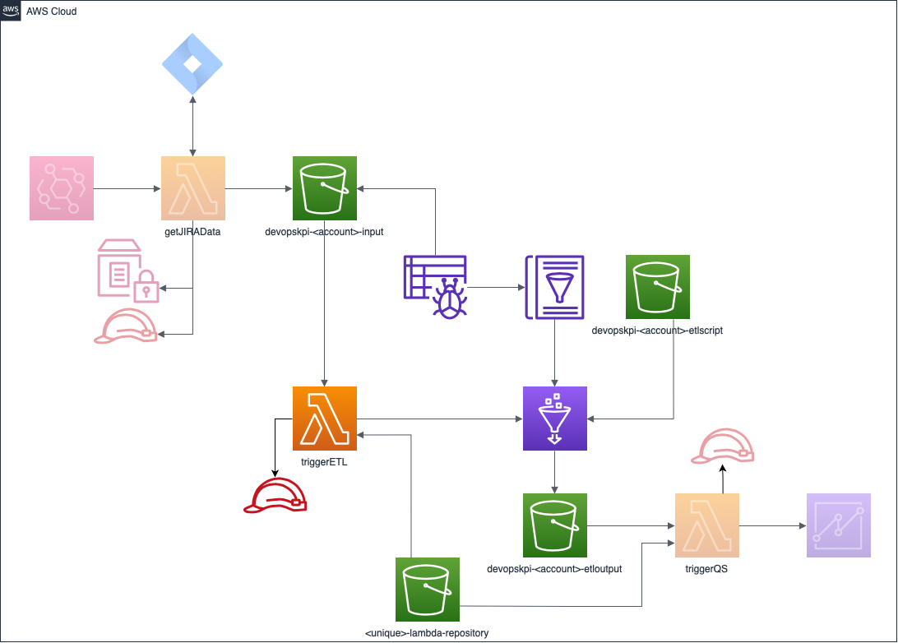

# Trigger ETL Lambda

A lambda function that takes the data extracted from the [getJIRAData](https://github.com/Dazza65/getJIRAData) project, transforms it using AWS Glue and writes the output to an S3 bucket to be picked up by a subsequent job to ingest into AWS QuickSight for visualisation.

This is part 2 of an overall solution to provide DevOps Key Performance Indicators on a AWS QuickSight dashboard.
1. [Retrieve the data](https://github.com/Dazza65/getJIRAData)
1. Transfor the data and perform the KPI calculation (This repository))
1. Ingest the transformed data to QuickSight - Coming shortly

## Build and deploy

1. Clone the repository
1. Install the following dependencies
    1. [jq](https://stedolan.github.io/jq/)
    1. AWS CLI (v2.0.62)
1. <pre><code>./sh package.sh</code></pre>(Creates the triggerETL.zip file in the build folder)
1. <pre><code>./sh upload.sh</code></pre> (Copies the zip file to the specified S3 bucket to store the lambda function)

1. Create CloudFormation stack

1. <pre><code>./sh upload-etl.sh</code></pre> (Copies the ETL script used by the Glue job to the S3 etl-scripts bucket)

1. <pre><code>./sh create-s3-notification.sh</code></pre> (Adds the PutObject notification event to the S3 input bucket that is created in part 1 of the solution to trigger this lambda)

## The following AWS resources are created

1. Lambda function
1. Glue
    1. Crawler
    1. Classifier
    1. Database
    1. Job
1. Role - the execution role associated with the Lambda function to provide access to XRay, SSM, S3 and CF
1. S3 buckets
    1. source for the retrieved JIRA issues.
    1. output for transformed data
    1. ETL script

## Architecture Diagram

